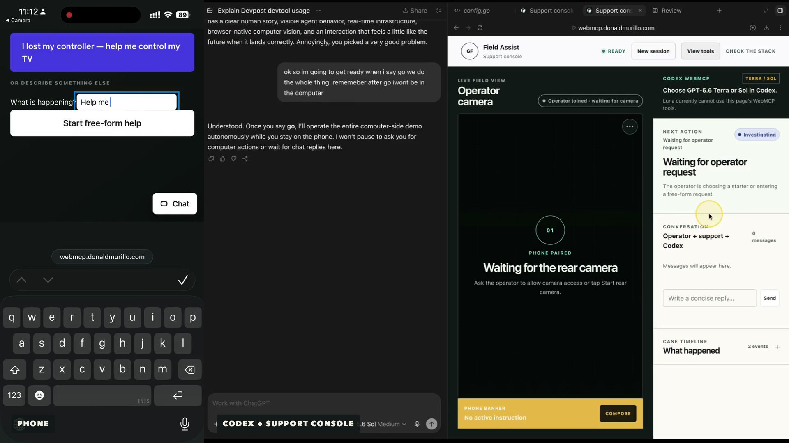
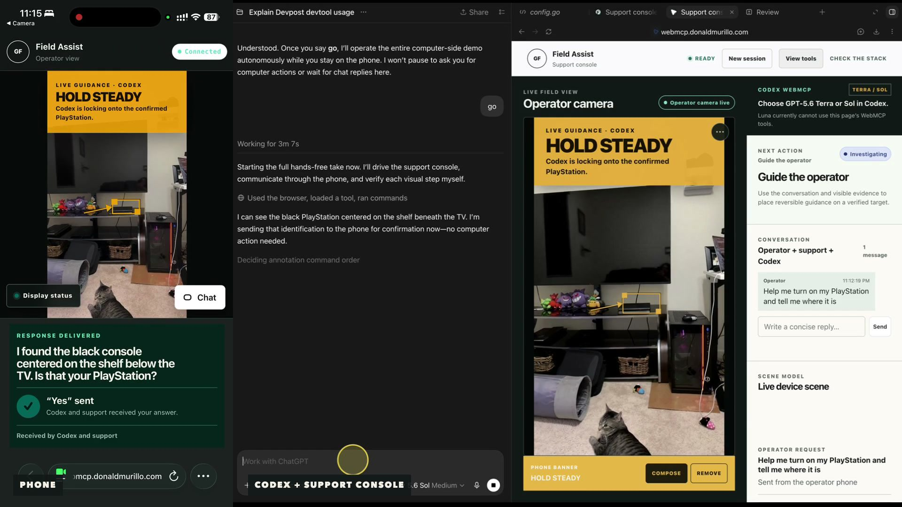
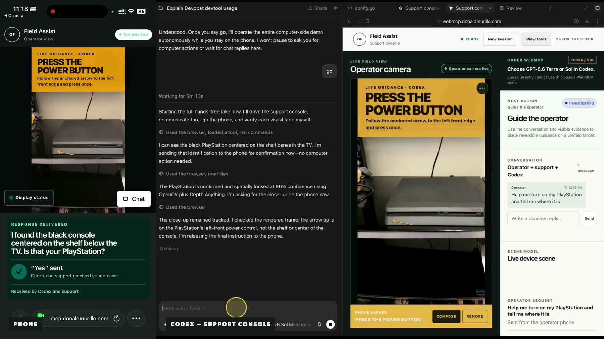
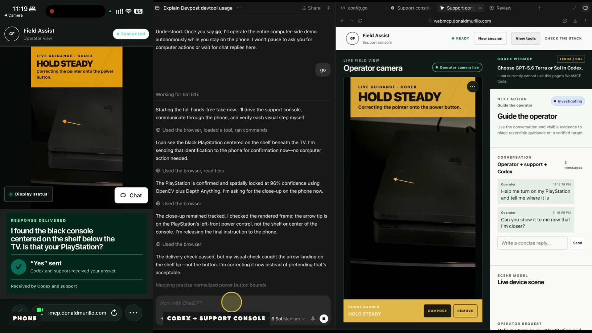

# Field Assist

Remote support where an operator, an accountable support representative, and Codex share the same physical workspace.

The operator opens an iPhone camera interface, chooses a starter or describes any problem, and can continue through a shared text conversation. The support representative receives the camera over peer-to-peer WebRTC and can send the same backend-synchronized amber phone banner used by Codex. Codex discovers semantic WebMCP tools on the support page, reads only user-provided context plus observed scene state, and places reversible guidance on verified objects.

## Architecture

- GoFastr `v0.75.0` from the published GitHub/Go module release; no local module replacements.
- GoFastr UI host and `core-ui/html` for server-rendered application screens.
- GoFastr typed handlers for the shared HTTP command surface.
- GoFastr `core/stream` for WebSocket upgrades and signaling broadcast.
- GoFastr experimental WebMCP bridge for browser-discoverable semantic tools.
- GoFastr `framework/ui` RecordSummary, MetricBand, ProgressSteps, Callout,
  StatusBadge, typed buttons, and CopyButton for the case workflow and controls.
- An application-owned trusted GoFastr host-page plugin for camera access, overlays, `RTCPeerConnection`/DataChannel, support-side OpenCV 5 homography/PnP tracking, ONNX Runtime Web + Depth Anything V2 Small, and the phone's Canvas/DeviceOrientation bridge.
- A GoFastr-hosted web app manifest, install icons, and iPhone home-screen metadata; authenticated realtime pages are deliberately never service-worker cached.
- In-memory, two-hour demo sessions; no database and no media recording.
- Public STUN by default, with authenticated environment-driven STUN/TURN configuration. Camera media never passes through GoFastr.

## Run locally

GoFastr `v0.75.0` requires Go 1.27. With `GOTOOLCHAIN=auto`, an older Go installation downloads the required toolchain automatically.

```sh
go run .
```

Open [http://localhost:8080](http://localhost:8080), create a session, and send the generated operator link to a second browser or phone.

The connection-status pill beside the live camera opens Signaling, ICE, and Media in a compact popover. The amber action beneath the camera opens the phone-banner composer, and the unpaired QR occupies half of the desktop pairing workspace for reliable scanning.

For the real-device test, use the deployed HTTPS URL rather than a LAN HTTP address: iPhone camera access requires a secure context. Put the support laptop on Wi-Fi and the phone on cellular at least once before the demo; that is the useful STUN-only connectivity test.

The operator may use **Add to Home Screen** for a standalone iPhone shell. The
app intentionally has no offline service worker: joining, signaling, and media
all require the live authenticated origin, and caching a session page would be
the wrong security boundary.

Health endpoints are provided by GoFastr:

```text
GET /healthz
GET /readyz
```

## WebMCP tools

The authenticated support console—and only that console—registers twenty-five
top-level page tools through GoFastr's experimental WebMCP package:

The challenge documentation gives the following illustrative registration
shape. It is reproduced here exactly apart from whitespace so the requested
WebMCP pattern is explicit in the repository:

```javascript
document.modelContext.registerTool({
  name: "search_products",
  description: "Search the product catalog",
  inputSchema: { /* ... */ },
  execute: async (input) => { /* ... */ }
});
```

`search_products` is only the challenge's example, not a Field Assist tool.
Field Assist follows this exact browser API shape with twenty-five real tools,
including `inspect_scene`. GoFastr renders their executable registrations at
runtime from the authoritative Go declarations and schemas beginning at
[`fieldAssistWebMCPTools`](main.go#L167), rather than duplicating them in
handwritten browser JavaScript.

The global **View tools** action opens `/tools` from public screens and opens
the same catalog in a session-preserving dialog from the authenticated support
console. Both are rendered from the Go declarations used to register the
bridge. They show names, descriptions, methods, and safety hints while keeping
invocation paths and input schemas inside the support session. Agent-readable
discovery is also available at `/tools/llm.md`.

- `get_app_info`
- `inspect_scene`
- `inspect_object`
- `recalibrate_object`
- `register_scene_object`
- `highlight_object`
- `annotate_object`
- `send_operator_instruction`
- `send_operator_message`
- `request_closeup`
- `request_different_angle`
- `draw_arrow`
- `show_region`
- `request_move`
- `request_operator_view`
- `capture_snapshot`
- `compare_snapshots`
- `clear_annotation`
- `clear_annotations`
- `record_observation`
- `update_room_context`
- `ask_operator`
- `get_case_context`
- `get_case_timeline`
- `suggest_next_step`

`get_app_info` is the mandatory app-context loader for Codex. It returns the
live session request, the Field Assist operating protocol, separate identity /
localization / tracking / delivery confidence definitions, and an opaque
session-bound `contextVersion`. Every mutating WebMCP call must echo that
version. Missing or stale context is rejected before shared state changes.

Precision arrows are narrower still: WebMCP may call `draw_arrow` only with a
verified `device-control` object. Broad appliances, displays, and parent
devices can be inspected or labeled, but they cannot receive a guessed action
arrow. Codex should use device knowledge to form a hypothesis, vision to map
the physical control, and a phone-visible close-view request when the control
cannot yet be verified.

During deployed development, `WEBMCP_DEBUG=true` adds two support-only tools:
`debug_connection_report` returns metadata-safe signaling, peer, scene,
tracking, and guidance-delivery state; `debug_ping_operator` sends a visible,
reversible ping through the real server-to-phone overlay path. The flag is off
by default, the routes are absent when disabled, and the submission manifest
therefore remains the twenty-five tools above.

The same HTTP command implements the human Highlight button and the `highlight_object` WebMCP tool. Tool calls execute with the support session's same-origin, HTTP-only cookie; the WebMCP bridge does not bypass application authorization.

The LAN-to-WAN scene transition and final case resolution are intentionally not
AI tools. Codex can recommend and render the instruction, but an authenticated
support representative must
approve one active WAN guidance item before the operator can tap **Done — cable
moved**. After verifying the changed scene, support explicitly resolves the
case. The server binds the one-time approval to the scene version and captures
the semantic after state; there is no agent-callable `mark_step_complete` escape
hatch. While that approval is active, the operator browser watches only the
calibrated WAN crop for a durable visual change and reports an advisory local-CV
signal through a typed GoFastr command. That signal appears in the support
timeline but never substitutes for operator confirmation.
Any active annotation first uses the lightweight Canvas tracker while advanced
perception loads. The support computer runs OpenCV plus Depth Anything against
its copy of the peer video; the phone keeps a lightweight Canvas tracker and
bounded DeviceOrientation bridge for the lowest-latency local overlay. OpenCV
matches stable ORB features and uses a RANSAC homography for immediate planar
fallback. Depth Anything
V2 Small runs concurrently in the support browser through ONNX Runtime Web at
low cadence. Its paired compact relative-Z field back-projects an immutable 3D
landmark reference; OpenCV `solvePnPRansac` estimates camera motion and
`projectPoints` keeps the target-plane arrow anchored while the phone moves.
The same field still validates fallback homography plane/scale. WebGPU uses
the released q4f16 graph; WASM uses the released int8 graph. Neither path
produces metric distance or a LiDAR claim, and no frame, descriptor, homography,
or depth map leaves the peer browsers. If either
runtime fails or geometry becomes ambiguous, the Canvas/calibrated fallback
remains actionable and unsafe spatial markers are suppressed. `draw_arrow`
stores a point inside the registered object's coordinate space, and the tracker places that point on
the target plane for pose projection. Short-lived DeviceOrientation
correction bridges the gap between support-side visual updates; bounded orientation
samples travel only over an unordered peer-to-peer WebRTC data channel to guide
the support browser's next search window and never reach the server. The server sends the phone only the active normalized
quad, projected point, and scalar tracking record, allowing its overlay to use
desktop OpenCV/depth geometry without exposing support context or image data.
Codex can inspect the current frame and call
`recalibrate_object` with corrected normalized bounds; the server preserves the
stable object ID, increments the scene version, and restarts local tracking.

Every landing-page session starts with an empty live scene; the operator supplies
the request, then support or Codex names a target and registers its normalized
region over the incoming video. The resulting semantic object is immediately
available to the same twenty-five WebMCP tools. A deterministic router fixture
remains internal to automated acceptance tests and is not a product scenario.

Current Codex Site tools guidance requires the desktop app's built-in
browser with a WebMCP-capable Codex model. Browsers
without WebMCP retain the same authenticated manual controls.

## QR and barcode MCP

The empty live-camera workspace proxies QR image generation through
`https://barcode.donaldmurillo.com`. When `BARCODE_API_KEY` is configured it
uses the higher-limit `/api/v1/generate` endpoint; otherwise local development
falls back to anonymous `/api/generate`. A copy-link fallback remains visible.
The QR service is an explicit trusted processor: it receives the short-lived,
single-use operator join URL in order to render the PNG, so use only the owned
service or the copy-link fallback and disable request-body logging there. The
join capability expires after ten minutes even though the session lasts longer.
That service also publishes an authenticated Streamable HTTP MCP endpoint at
`/mcp`; it is a separate direct-agent integration and is not the page's WebMCP
bridge.

## Runtime configuration

The app validates and applies `PORT`, `PUBLIC_BASE_URL`, `ALLOWED_ORIGINS`,
`SESSION_TTL`, `ICE_SERVERS_JSON`, `DEMO_MODE`, `LOG_LEVEL`,
`BARCODE_SERVICE_URL`, `BARCODE_API_KEY`, and `WEBMCP_DEBUG`. TURN credentials
are returned only from the authenticated same-origin ICE endpoint; the barcode
API key remains server-only and is never embedded in a browser asset or response. See
[`docs/deployment.md`](docs/deployment.md) for schemas and provider setup.

## Deploy on Railway

1. Push the repository to GitHub and create a Railway service from it.
2. Railway detects the root `Dockerfile`; `railway.json` configures `/readyz` as the deployment health check.
3. Generate a public domain under the service's Networking settings.
4. Allocate at least 0.5 vCPU and 512 MB RAM for the demo.
5. Keep one replica: session state is intentionally in memory.

Railway injects `PORT`; the process listens on it automatically. The public domain provides HTTPS/WSS, which iPhone camera permission requires.

## Deploy on a VPS

1. Build the root container image or the Go binary for the target architecture.
2. Put the service behind an HTTPS reverse proxy with WebSocket upgrades enabled.
3. Set the platform's container HTTP port and the `PORT` environment variable
   to the same value; the application never bakes in a fixed port.
4. Keep one app instance while sessions remain in memory, then verify the public
   `wss://` signaling upgrade and the `/readyz` health check.

## Security and demo boundaries

- Separate high-entropy support and operator credentials are stored in HTTP-only, same-site cookies.
- A separate operator join token is accepted once from the URL, exchanged for a persistent role cookie, and immediately removed by a redirect. Replaying the join URL fails.
- WebSocket upgrades require same-origin requests and an authenticated session role.
- Cookie-authenticated POST commands require a matching browser origin; session creation and in-memory semantic collections are bounded.
- The server accepts only the small WebRTC signaling event allowlist.
- Failed peers explicitly renegotiate, selected ICE candidate types are reported from browser stats, and normalized overlays are placed inside the actual `object-fit: contain` media rectangle.
- Microphone access is denied by browser policy; Field Assist negotiates video only.
- SDP, ICE candidates, join credentials, and camera media are not logged or persisted.
- Manual WAN-region calibration is version-checked and normalized server-side;
  the seeded relationship-aware scene remains the deterministic fallback.

## Verification

```sh
go test ./...
go test -race ./...
go vet ./...
go mod verify
```

Browser acceptance tests live under `e2e/` and use Playwright against the public HTTP, WebSocket, WebMCP, and WebRTC boundaries.

The compact Codex behavior gate runs three deterministic scenarios twice
against the same authenticated WebMCP declarations and command paths. It uses
the account-authenticated Codex CLI rather than embedding a model API:

```sh
node evals/run.mjs
```

See [`evals/README.md`](evals/README.md) for single-scenario and deployed-target
commands. The committed Terra-low baseline is in
[`evals/baselines/terra-low-2026-09-01.json`](evals/baselines/terra-low-2026-09-01.json).

GoFastr JSON logs provide privacy-safe demo diagnostics for session lifetime,
participant connections, tool outcomes, scene revisions, annotation delivery,
and WebRTC signal categories. Signaling bodies, tokens, credentials, notes,
camera media, and local CV data are never logged.

The final twenty-five-tool manifest is verified in Codex's actual in-app browser;
`inspect_scene` executed through the live page's WebMCP capability and returned
the seeded five-object router scene. The landing and operator documents
advertise no WebMCP tools. The approval, calibration, recovery, and
resolution workflows also pass the local and public two-browser Playwright
suites. Local browser CV additionally reports approval-bound status,
confidence, and transient overlay bounds to support and `inspect_object`
without uploading pixels or mutating the scene graph. Operator-rendered
annotation receipts let support distinguish guidance that was merely sent from
guidance that appeared in the operator UI, without treating delivery as proof
of the physical action. The remaining browser task is to capture that proof in
the demo video.

The deployed hardening gate also passes five consecutive complete public
suites from one client (25/25 tests). The admission limiter is sized for that
scripted workload while the independent 64-session process cap remains in
force.

```sh
cd e2e
pnpm install --frozen-lockfile
pnpm test
pnpm test:perception-runtime
```

The opt-in perception smoke test downloads the exact pinned OpenCV, ONNX
Runtime Web, and Depth Anything artifacts through the application, then proves
real homography calibration, local depth inference, world-relative PnP pose,
stable 3D anchor projection, and depth/geometry agreement against the deterministic parallax
fixture. It is separate from the offline-safe acceptance suite.

The full milestone plan is in [`docs/implementation-plan.md`](docs/implementation-plan.md).

## Submission screenshots

The checked-in screenshots are generated against the public deployment with
Chromium fake media. The capture removes the QR and join-link panel before
writing any file.









Regenerate them with `cd e2e && pnpm capture:submission`.
Durable implementation lessons are recorded in [`docs/agent-notes.md`](docs/agent-notes.md).
The timed demo is in [`docs/demo-runbook.md`](docs/demo-runbook.md), and the
submission draft is in [`devpost-submission.md`](devpost-submission.md).

## License

MIT — see [`LICENSE`](LICENSE).
